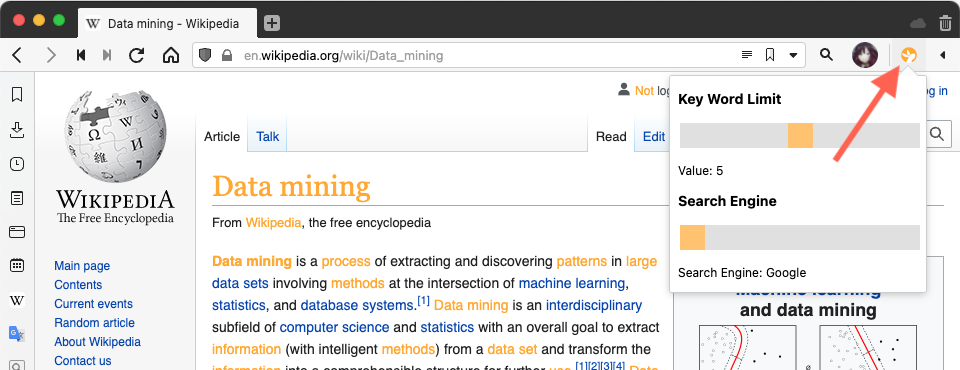
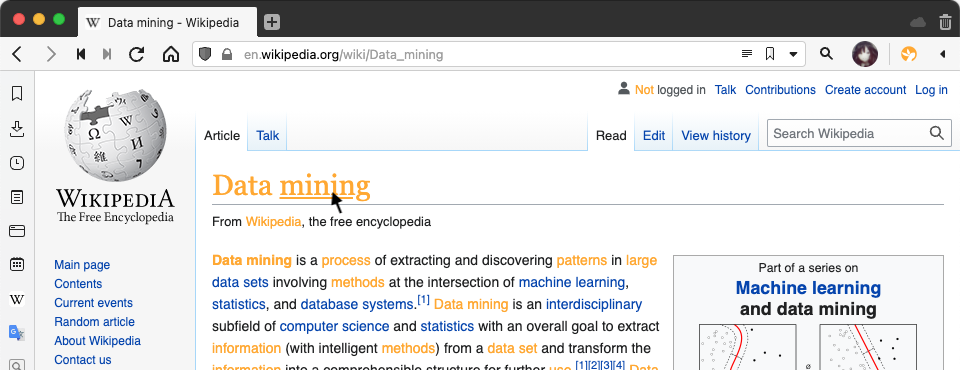
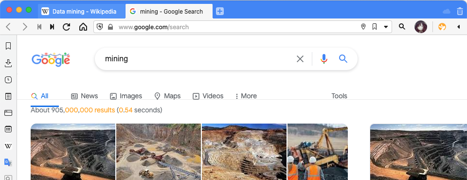

# Rabbit Hole

## CS410 Fall 2021 Course Project

> A Chrome Extension that speeds up research with autodetected key words.

### Documentation Contents

1. [Overview](#overview)
2. [Installation](#installation)
3. [Usage](#usage)
4. [Demonstration](#demonstration)
5. [Team Contributions](#team-contributions)

### Overview

Rabbit Hole is a Chrome Extension whose goal is to improve Internet research by intelligently identifying key words in web pages and converting those words to clickable links to search pages. To do this, Rabbit Hole uses a [light-weight English language model](https://winkjs.org/wink-nlp/wink-nlp-in-browsers.html) run entirely client-side using [WinkNLP](https://winkjs.org). After scraping the page for text content, the language model is used to preprocess and tokenize the contents, then the top tokens (by frequency) are chosen to replaced into links.

The extension is written entirely using JavaScript with HTML/CSS used to style the popup window for the extension. [NodeJS](https://nodejs.org/en/) and [Browserify](https://browserify.org) are used bundle the dependencies and convert them to a format compatible with Chrome browsers for client-side use.

---

### Installation

To install the Rabbit Hole extension you will need a Chromium-based browser (Chrome, Vivalidi, etc.) that supports Chrome Extensions.

**Step 1**: Clone this GitHub repository.

```bash
git clone https://github.com/pehartma/CourseProject.git
```

**Step 2**: In your Chromium-based the Extensions menu. If you are using Chrome, make sure you have enabled _Developer Mode_ by clicking the toggle switch on the top right, then select the _LOAD UNPACKED_ button on the top menu and select the directory in which you cloned this repository.


And you're done! The Rabbit Hole extension will now be installed on your browser.

---

### Usage

 Once the Rabbit Hole extension has been enabled in your browser, navigate to a webpage. Once there, click on the extension popup in your browser's taskbar.

 

 From the popup, you can adjust the sliders to adjust the key word sensitivity (the minimum frequency for each key word) and the search engine for links.

**Note: In order for your changes to be reflected, you'll need to refresh the page.**

The extension will automatically try to detect key words on the webpage and will turn instances of these words into clickable links for you to navigate with.



When you click on the link you'll be taken to the search page for the key word.



**Note: You will have to set your slider settings per webpage at the moment.**

---

### Demonstration

---

### Team Contributions

#### Peter Hartman (Leader)

* General program structure
* Popup UI (HTML & CSS)
* Diplay module
* Execute module
* Module interaction

#### Steven Hernandez

* Text extraction
* Text preprocessing
* Language model integration
* Text replacement
* Persistent state for controls
* User testing
* Project Documentation & Demo

#### SangJin Hyun

* User Testing
* Popup (display)

---
